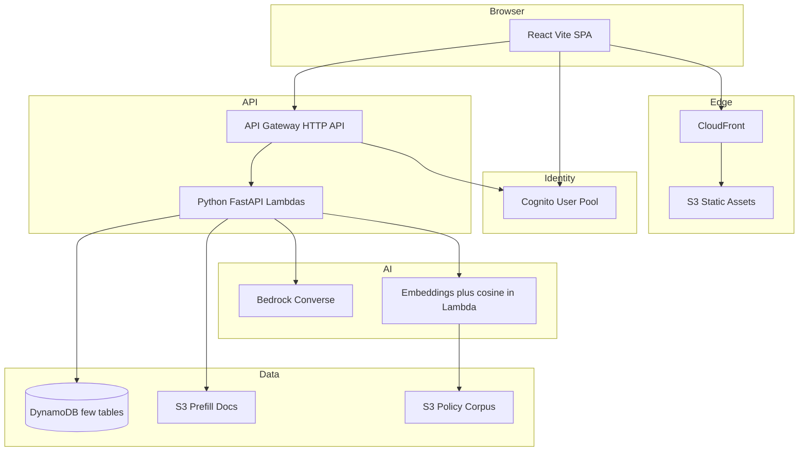

# TurboImmi — Tech Stack (P0)

> Last updated: 2026-09-10 (ADR 016: Cognito `Admin` + `/admin` desk; CD Day 13)  
> **Status: LOCKED for P0** (confirmed by product owner; region **`us-east-2`**, ADR 011)  
> Audience skills: Python, SQL, Spark, AWS, Databricks  
> Goal: cost-effective, serverless-first, agentic on AWS in ~2 weeks (solo)

## Verdict on static site on S3

**Yes — good idea for P0**, with these constraints:

| Do this | Why |
|---------|-----|
| **React (Vite) SPA → S3 + CloudFront** | Cheap, HTTPS, CDN, fits Cognito + API Gateway |
| CloudFront SPA fallback (`404/403 → /index.html`) | Client-side routing works |
| Cognito in the browser; **all secrets/AI calls on backend** | Never put Bedrock keys or agent tokens in the static bundle |
| API Gateway + Cognito JWT authorizer | SPA talks only to your APIs |

**Not ideal alone:** raw S3 website endpoint (no HTTPS custom domain / weaker edge). Always put **CloudFront** in front.

**Skip for P0:** Next.js SSR / Amplify SSR / ECS for the UI — more cost and ops. Revisit SSR later if SEO for attorney marketing pages matters (or add a tiny static marketing page).

**Spark / Databricks:** out of P0. Great later for analytics on anonymized funnels; not for request path.

---

## Locked P0 stack

| Layer | Choice | Rationale |
|-------|--------|-----------|
| **Frontend** | **React 18 + TypeScript + Vite** | Fast SPA, huge ecosystem, static export to S3; lighter than Next for your model |
| **UI kit** | Tailwind CSS + headless components (e.g. Radix) | Speed without heavy design system |
| **Hosting** | **S3 + CloudFront** (+ optional Route 53) | Matches your plan; low cost |
| **Auth** | **Amazon Cognito** User Pool | Groups: `Applicant`, `Attorney`, `Admin`; Hosted UI in P0. Admin is allowlist-grant, not a chooser button (ADR 016) |
| **API** | **API Gateway HTTP API** + **Python 3.12 Lambda** | Pay-per-use |
| **API style** | **FastAPI** behind Lambda ([Mangum](https://mangum.io/)) | OpenAPI + clear routers; no thin-handler alternative in P0 |
| **Database** | **DynamoDB** (on-demand, **PITR on**), **few tables** | Serverless; access-pattern keys per table (see [API_AND_DATA.md](API_AND_DATA.md) on Day 1) |
| **Files** | **S3** private bucket + **presigned URLs**; jpeg/png/pdf; max **8 MB**; max **2 files**; **lifecycle 14 days** + delete-after-confirm | Prefill uploads are PII; encrypt with SSE-S3 or SSE-KMS |
| **AI** | **Amazon Bedrock Converse first**; AgentCore skipped on Day 0 | Extract, cited chat, explain validation |
| **Doc extract** | Bedrock multimodal (vision) on uploaded image/PDF pages | Enough for thin passport + offer letter; Textract optional later |
| **RAG** | Bedrock embeddings + in-Lambda cosine over S3/DDB chunks (tiny H-1B corpus). Bedrock KB only if an S3 Vectors backend is cheap/available (local ADR 009) | Avoid OpenSearch Serverless cost floor |
| **Validation** | **Python rules engine** first; Bedrock only explains failures | Cost + determinism |
| **News** | **Manual H-1B alert cards** + follow-links to @USCIS in P0 | HTML poll is a cut-order item; no paid X API |
| **Disclaimer** | `shared/disclaimer.json` imported by frontend + backend | Copy never drifts |
| **Region** | **`us-east-2`** (Ohio) | Single-region P0; bootstrap, Bedrock, and CD all here (ADR 011) |
| **Local AI assist** | Agent Toolkit for AWS (Cursor MCP `aws-mcp` + skills) | Day 0 local tooling only; control plane is us-east-1 |
| **IaC** | **AWS CDK (Python), IaC-first** | All P0 AWS resources in `infra/`; CDK-owned `$10` budget (local ADR 013; import not supported); no lasting click-ops (local ADR 012) |
| **CI/CD** | **GitHub Actions** + **OIDC → AWS** → CDK deploy + `aws s3 sync` / CloudFront invalidate | No long-lived keys |
| **Secrets** | Local `.env` + `SETUP.local.md` (gitignored); `.env.example` keys only; SSM/Secrets Manager at runtime | Never commit emails, account IDs, keys, or PII |
| **Observability** | CloudWatch Logs + alarms | Cost alarms on Bedrock + Lambda |

### Explicitly deferred (not P0)

- RDS/Aurora Postgres (revisit if marketplace queries get painful)
- OpenSearch cluster / OpenSearch Serverless (in-Lambda retrieval first)
- Databricks / Glue / Spark
- ECS/EKS always-on
- Paid X API
- Full document vault product
- Attorney “Match Agent” (P0 is directory **filters** only)
- Automated news poll Lambda (P0 is **manual cards**)

---

## Architecture (P0)



**Local loop:** Vite `localhost:5173` + FastAPI `localhost:8000` talking to the **one real AWS account** (Cognito, DynamoDB, S3, Bedrock). No LocalStack.

**Request split (important for 2 weeks):**

1. **Deterministic APIs (Lambda/FastAPI):** profile CRUD, attorney directory, Admin publish/flag, consult requests, validation score, news list, presigned upload, confirm-prefill write.
2. **Bedrock Converse:** doc extraction suggestions, cited policy chat, “explain this validation failure.”
3. Extract / chat **never silently write** profile fields — only the confirm API persists after user approval.

---

## Frontend recommendation (detail)

**React + Vite + TypeScript on S3/CloudFront** is the best fit for:

- Static-site hosting
- Cognito SPA auth
- Solo speed (vs Next App Router + SSR hosting)

**App structure (conceptual):**

- `/` marketing landing (static)
- `/app/*` applicant flows (prefill, interview, score, chat, attorneys)
- `/attorney/*` attorney profile + consult inbox
- `/admin` verification desk (allowlisted Admin only)
- Shared disclaimer banner + attorney-review gates

**Auth UX:** Cognito Hosted UI is fastest for P0; custom login screens later.

**Alternatives considered:**

| Option | Verdict |
|--------|---------|
| Next.js static export | OK, but Vite is simpler if you are not SEO-heavy |
| Next.js SSR on Amplify/Lambda | Overkill for P0 cost/time |
| Pure HTML/Jinja from API | Too weak for dual-role SPA |
| Flutter/mobile | Out of scope for P0 |

Keep pages simple (forms, lists, chat panel); AI does the heavy lifting on the backend.

---

## DynamoDB — few tables (P0)

Not single-table. Day 1 writes keys into [API_AND_DATA.md](API_AND_DATA.md). Intended tables:

| Table | Purpose |
|-------|---------|
| **Users** | Profile JSON (journey stage enums), role-chosen flag |
| **Cases** | H-1B packet / interview / form-field map / score / attestation |
| **PrefillJobs** | Extract suggestions before confirm (TTL ok) |
| **Attorneys** | Profile; GSI on specialty / state; `published`, `verified` |
| **Consults** | PK attorney, SK consult; GSI by applicant |
| **Alerts** | Official news cards |
| **PolicyChunks** | Text + embedding + `source_url`, `title`, `retrieved_at`, `content_hash` |
| **AiAudit** | Per-user timestamped rows, **TTL**; never store OCR text |

Store journey stage enums on profile JSON for F-1→EB even if UI is H-1B-only.

---

## Cognito

- App client for SPA (public client + PKCE); Hosted UI with a unique domain prefix (Day 0)
- Groups: `Applicant`, `Attorney`, `Admin`
- **Role assignment (P0):** Hosted UI has no role picker. After first login, if the JWT has no group → in-app chooser (**Applicant / Attorney only**) → `POST /me/role` → Lambda `AdminAddUserToGroup` → client **forces token refresh** → role-based redirect
- **Admin grant:** `ADMIN_ALLOWLIST_EMAIL` compared on `GET /me`; then `AdminAddUserToGroup(Admin)`. Never offer Admin on the chooser. Do not create the user in the Cognito console
- **Role lock:** after the first successful choose, **no self-switch** Applicant ↔ Attorney. An address that already chose is not promoted to Admin
- API Gateway JWT authorizer; Lambda checks `cognito:groups` for route guards
- **Attorney directory is authenticated-only in P0.** Profiles default `published=false`, `verified=false`; UI shows “Unverified”; seeded demo attorneys start published; Admin publishes or flags after basic field checks (not a bar lookup)
- Cognito **default email** (no SES) is enough for P0; watch the daily send cap

---

## Bedrock usage (P0)

| Capability | Approach |
|------------|----------|
| Passport / offer letter extract | Bedrock vision → structured JSON → **confirm UI** → profile write API |
| Policy chat | **Converse** + in-Lambda retrieval tool; **citation-or-silence**; `shared/disclaimer.json` in the system prompt |
| Validation explain | Rules compute score; model explains rule hits only |
| Form fill | Deterministic mapping from profile → form fields |

**Model pick:** Amazon Nova Lite for chat + vision (US cross-region inference profile) and Titan Text Embeddings V2 for RAG. Record exact IDs in local `SETUP.local.md` and `.env` (`BEDROCK_CHAT_MODEL_ID`, `BEDROCK_VISION_MODEL_ID`, `BEDROCK_EMBED_MODEL_ID`) only. Cap max tokens + daily budget alarm.

**Converse first.** Day 0 AgentCore probe (2026-09-08): control-plane APIs work in `us-east-2`, but the `agentcore` CLI is not installed and a harness would be extra IAM outside CDK. **Skipped for P0.** Stay on Converse.

---

## IaC + CI/CD

```
infra/          # AWS CDK (Python)
backend/        # FastAPI / Lambda handlers, rules
frontend/       # Vite React app
shared/         # disclaimer.json
docs/           # public stack, setup, API, git docs
.github/workflows/ci.yml   # checks from Day 2; deploy job from Day 13
.github/pull_request_template.md  # public docs-sync checklist
```

**IaC-first (local ADR 012 + 013):** every P0 AWS resource lives in `infra/`. **Day 0** starts the CDK app + `$10` budget construct + `cdk synth`. CloudFormation cannot import `AWS::Budgets::Budget`, so the CLI budget is deleted once and recreated by `cdk deploy` under the same name. Day 2+ adds hello-path resources to the **same stack**. Console/CLI only for Bedrock model access, bootstrap, and local Agent Toolkit.

**Pipelines** (see [GIT_AND_CICD.md](GIT_AND_CICD.md)):

1. **CI (Day 2+):** pytest → `npm run build` → `cdk synth` on PR and `main`
2. **CD (Day 13+):** on merge to `main`: CDK deploy (same app: budget + resources) → `s3 sync` → CloudFront invalidation via **GitHub OIDC → AWS**
3. Protect `main`; one env `dev` for P0

---

## Cost controls (P0)

- On-demand DynamoDB; Lambda memory right-sized
- CloudFront + S3 (pennies for traffic)
- Bedrock: token caps, cache policy chunks, rules-first validation
- One region (`us-east-2`)
- Billing alarm + Bedrock usage alarm day one (CDK-managed `$10` budget `turboimmi-dev-monthly`; email from `BUDGET_ALERT_EMAIL`; CD must not rewrite that alarm — local ADR 019)
- Prefill: max 2 files, 8 MB, jpeg/png/pdf; 14-day lifecycle
- Per-user daily caps on extract + chat (exact numbers in API_AND_DATA on Day 1)
- No OpenSearch Serverless in P0
- Cost checkpoints: Day 7 and Day 15 (Cost Explorer)

---

## What we are *not* debating for P0

- Kubernetes
- Microservices sprawl (one API package is enough)
- Real-time multiplayer case rooms
- Mobile apps

---

## Next steps

Day 0: [SETUP.md](SETUP.md). Day 1: scaffold + [API_AND_DATA.md](API_AND_DATA.md). Day 2: hello path **deployed**. Day 3: profile + role chooser.

---

## Lock status

**LOCKED (2026-09-10; FastAPI-only, few tables, Converse-first, AgentCore skipped on Day 0, 14-day uploads, `us-east-2`, IaC-first, Cognito `Admin` via allowlist).** Do not change P0 stack without a new **local** ADR and updates to this file and `AGENTS.md`.
